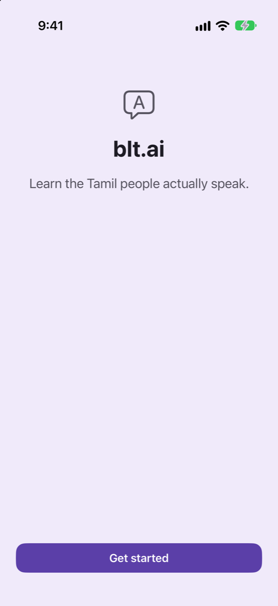
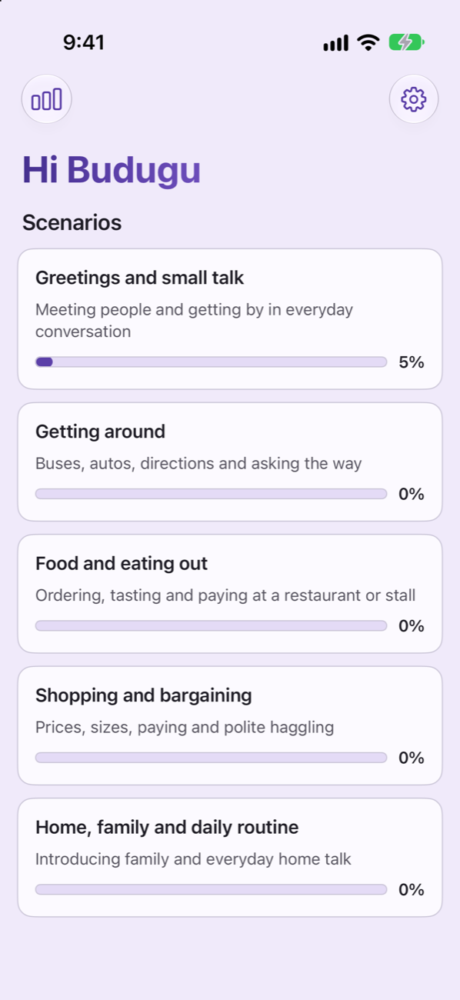
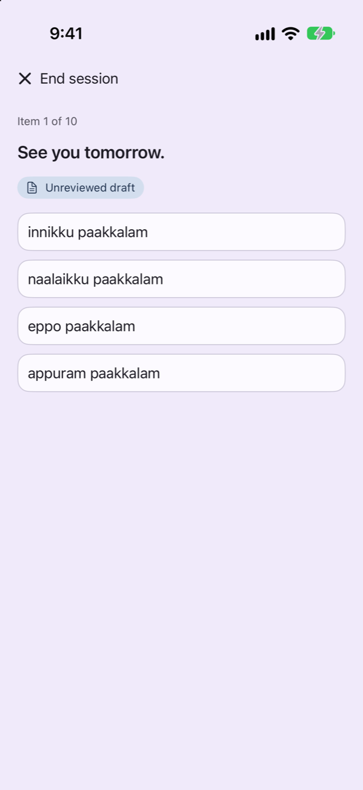
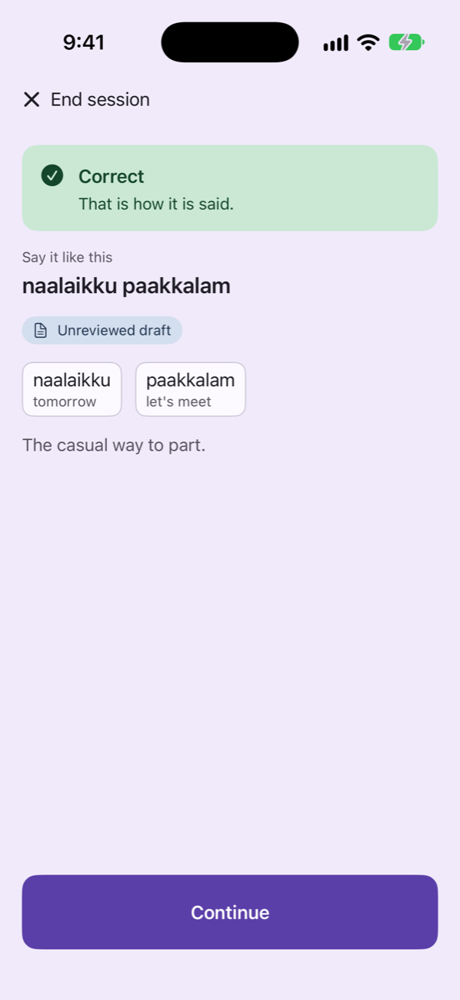
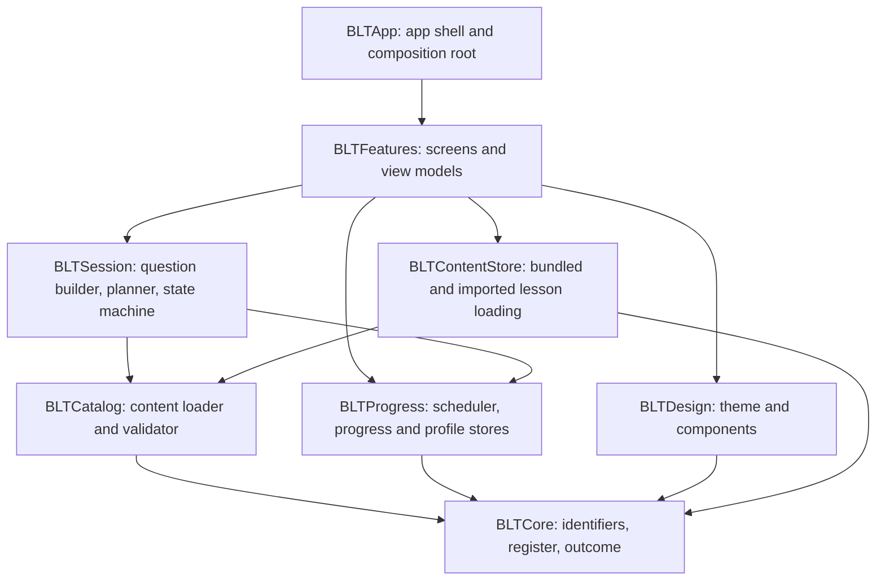

# blt.ai

**Budugu Learns Tamil / Telugu.** An iOS app for a couple who speak different languages at home: one learns the Tamil people actually speak, the other the Telugu people actually speak, with English as the language they share.

[](https://github.com/darshan-r27/blt.ai/actions/workflows/ci.yml)

<p>
  
  
  
  
</p>

This is a portfolio project. It runs on a simulator or your own iPhone; it is not on the App Store.

> **Where it stands.** The app and the first part of the Tamil course are built and described below. The language choice (first launch and Settings) is built. The Telugu lessons and the full 2,000-phrase courses are planned and in progress: see [Roadmap](#roadmap), [`plan.md`](plan.md) and [`docs/COURSE_SYLLABUS.md`](docs/COURSE_SYLLABUS.md). The screenshots show the current, Tamil-only build.

## Who it is for

A couple where one partner grew up speaking Tamil and the other Telugu. They talk to each other in English, and neither can follow the other's family at the dinner table. Each wants the other's everyday spoken language, not the textbook one. blt.ai gives each of them a course in the other's language, built from the same syllabus, so they learn the same sentences and can practise on each other.

## The problem

Tamil has two forms that differ far more than "formal" and "informal" English do. Written Tamil is what textbooks, news readers and almost every language app teach. Spoken Tamil is what people use at a bus stop, in a shop, and at home, and its verbs, pronouns and endings are different.

A learner who finishes a mainstream course can read a signboard and still cannot hold a conversation. When they do speak, they sound like a news bulletin. Telugu has the same gap between the written language and everyday speech, in a milder form.

## The idea

Tamil and Telugu are both Dravidian languages. They share word order, the way endings stack onto words, and a large part of their vocabulary. A Telugu speaker already owns the grammar.

So blt.ai skips grammar lessons entirely and spends the learner's effort on two things:

- **Words.** Which word in the new language replaces the one you already know.
- **Register.** Whether you are talking to a friend or to an elder or a stranger. In Tamil that is `nee`, `da`, `di` against `neenga`; Telugu draws the same line.

The argument runs both ways, which is why one syllabus serves both courses. Only those two spoken registers are taught. Literary forms are left out on purpose, and English words that Tamil speakers use every day (phone, bus, ticket, bill) stay in English.

## What is built today

The Tamil course's first five lessons, and everything around them:

- **Five everyday lessons (Level 1), 100 phrases:** greetings, getting around, food, shopping, and home and family.
- **Multiple choice.** An English prompt, four options in romanised Tamil.
- **Feedback that teaches.** Each answer shows the phrase, a word-by-word gloss, and a note on who you would say it to.
- **Three outcomes, not two.** "Right sentence, wrong register" is its own result, so saying the casual form to an elder is corrected without being marked simply wrong.
- **Spaced repetition.** An SM-2 scheduler decides what comes back and when. A wrong answer is due again immediately, and a phrase counts as complete only when your latest answer was correct.
- **Shuffled sessions.** Each session samples up to ten phrases and shuffles questions and options, so you cannot pass by remembering positions.
- **Never red.** Mistakes are shown in a neutral tone. The app is meant to feel like practice, not a test.
- **Lessons can be updated on the phone.** Settings has an "Import lessons" action: pick lesson files from the Files app and the app validates them (all or nothing) and starts using them straight away. See below.
- **Private by construction.** The only personal data is a display name, stored on the device. There is no account, no network code, and no analytics.

## How it is built

Swift 6 with strict concurrency, SwiftUI, iOS 27. All logic lives in a local Swift package, and the app target is a thin shell around it.



A few choices worth a look:

- **Content is data, not code.** The phrases live in [`content/tamil/`](content/tamil/) and `content/telugu/` (one folder per course) as JSON and are validated when loaded. No Swift file contains Tamil text; tests use obviously fake fixtures. This is what makes a second language a content job more than a code job.
- **"No network" is enforced, not promised.** [`scripts/check-forbidden-apis.sh`](scripts/check-forbidden-apis.sh) fails the build if networking, audio or speech APIs, network entitlements or permission strings appear in the source. [`scripts/check-binary.sh`](scripts/check-binary.sh) then inspects the compiled app for the same thing.
- **Storage is two small JSON files**, written atomically with complete file protection. A damaged file is reported to the user and never silently overwritten.
- **No dependencies.** Nothing third-party is linked.
- **Warnings are errors**, in the package and in the test script, and SwiftLint runs in strict mode.
- **Decisions are written down.** [`docs/DECISIONS.md`](docs/DECISIONS.md) records 44 decisions, including the ones that were later reversed and why.

## Where the content stands

The 100 Tamil phrases were drafted by an AI and have all been checked by hand by a native Tamil speaker. Telugu lessons will be drafted the same way and checked by a native Telugu speaker ([`docs/REVIEWER_GUIDE.md`](docs/REVIEWER_GUIDE.md)). Every phrase carries a review status in its data file, and the app shows an "Unreviewed draft" label on any phrase that has not been checked. The Settings screen says the lessons are native-reviewed only when every phrase is marked reviewed; the statement is computed from the data, not typed in.

[`tools/content-editor/`](tools/content-editor/) is a single offline HTML page for that review: it walks through every phrase and applies the same validation rules as the app.

## Run it

You need Xcode 27 and an iOS 27 simulator. The examples use iPhone 17.

```bash
open BLTApp/BLTApp.xcodeproj
```

Choose the **BLTApp** scheme and press Run. To run the checks from the repository root:

```bash
BLT_SIM="iPhone 17" scripts/test.sh package
```

```bash
BLT_SIM="iPhone 17" scripts/test.sh app
```

```bash
swiftlint lint --config .swiftlint.yml --strict
```

```bash
bash scripts/check-forbidden-apis.sh
```

The first runs the package's unit tests. The second builds the app and runs the UI tests, including accessibility audits at the default and the largest text size. The full UI suite is slow (about 50 minutes on a busy machine), so run it per class when iterating, for example `scripts/test.sh app -only-testing:BLTAppUITests/HomeUITests`.

### Continuous integration

[The workflow](.github/workflows/ci.yml) runs the same four checks on every push and pull request. Because the app targets iOS 27, it uses GitHub's `xcode-27` runner image, which is still a public preview: runs may queue or fail for reasons on GitHub's side. If a runner lacks the iOS 27 SDK the job fails with a message saying so, and the tests are never skipped quietly. The local commands above are the reference.

## Updating lessons without Xcode

The lessons are the JSON files in [`content/tamil/`](content/tamil/) and `content/telugu/`. They ship inside the app, but they can also be replaced on the phone, so a change to the lessons does not need a rebuild:

1. Send the `content/tamil/*.json` or `content/telugu/*.json` files you want to the phone (AirDrop works) and save them to the Files app.
2. In blt.ai, open Settings, tap **Import lessons**, and choose the files (up to 20).
3. The app checks every file with the same rules as the bundled lessons. If all pass, they take effect at once and your progress is kept. If any file fails, nothing changes and the app says so.

Each language has its own lessons, progress and imports: a file is checked against the language you are learning and refused if it is for the other one, and switching language in Settings loses nothing. An imported file replaces the bundled lesson set with the same `scenarioId`, or adds a new one. **Remove imported lessons** in Settings goes back to the lessons that came with the app. If a newer build ships different bundled lessons for a scenario, the older import is ignored. The design and its safety rules are in [`docs/DECISIONS.md`](docs/DECISIONS.md) (036).

This does not remove the 7-day limit of installing with a free Apple ID: the app itself still has to be re-signed from Xcode every week. Only a paid developer programme (TestFlight) or a sideload refresher changes that.

## How it was made

The app was built with Claude Code, with the author acting as product owner and reviewer. One planning session produced a set of frozen interfaces; small, separately owned pieces were then built in parallel by agents in isolated git worktrees, merged one at a time, and verified after each merge. [`docs/MVP_PLAN.md`](docs/MVP_PLAN.md) is the plan, [`docs/WORKFLOW.md`](docs/WORKFLOW.md) describes the review process, and [`CLAUDE.md`](CLAUDE.md) holds the standing rules the agents worked under.

## Roadmap

**Now: two courses.** The plan is [`plan.md`](plan.md); the reasoning is decisions 038 to 044.

- Pick the language you are learning after entering your name; switch in Settings with each language's progress kept.
- A Telugu course beside the Tamil one, from one syllabus: 8 levels, 100 lessons and 2,000 phrases each, sharing English prompts wherever that is natural.
- Home grouped by level, checks against duplicate phrases, and a 100-question final exam per language with a pass mark of 75.
- Each course reviewed by its native speaker, one level at a time.

**v2: voice.** This is the original thesis, and v1 is the foundation for it. It applies to both languages.

- Hear each phrase at natural speed, recorded by native speakers.
- Answer by speaking. Recognition runs on the device; audio is deleted as soon as it has been scored.
- A classifier that notices when you produced the textbook form and shows you what a 25-year-old would actually say.
- Pronunciation is measured and shown as advice. It never blocks progress.

**v1.5: optional telemetry.** Off by default, opt-in, and confined to one module. The design and threat model are in [`docs/BACKEND.md`](docs/BACKEND.md).

**Later.** Native script alongside romanisation, and the same approach for other pairs of related languages.

## Documents

| Document | What it is |
| --- | --- |
| [`docs/ARCHITECTURE.md`](docs/ARCHITECTURE.md) | How the code is organised: modules, data flow, storage, and what enforces the rules. |
| [`plan.md`](plan.md) | The current plan: two courses, Tamil and Telugu. |
| [`docs/COURSE_SYLLABUS.md`](docs/COURSE_SYLLABUS.md) | The syllabus both courses follow: 8 levels, 100 lessons, exam blueprint. |
| [`docs/REVIEWER_GUIDE.md`](docs/REVIEWER_GUIDE.md) | How a native speaker reviews a course's lessons. |
| [`docs/MVP_PLAN.md`](docs/MVP_PLAN.md) | The v1 plan: interfaces, work breakdown, review checklist. |
| [`docs/DECISIONS.md`](docs/DECISIONS.md) | The decision log. Start here for the reasoning. |
| [`docs/PRD.md`](docs/PRD.md) | The full product specification, written for the voice version (v2). |
| [`docs/BUILD_PLAN.md`](docs/BUILD_PLAN.md) | The original task sequence, including the v2 voice phases. |
| [`docs/SECURITY.md`](docs/SECURITY.md) | The security review rubric. |
| [`docs/BACKEND.md`](docs/BACKEND.md) | The telemetry design for v1.5. |
| [`docs/RECORDING_GUIDE.md`](docs/RECORDING_GUIDE.md) | How to record colloquial Tamil without drifting into the formal register. |
| [`docs/HANDOFF.md`](docs/HANDOFF.md) | Current status and how to pick the work up. |

## Licence

[MIT](LICENSE).
