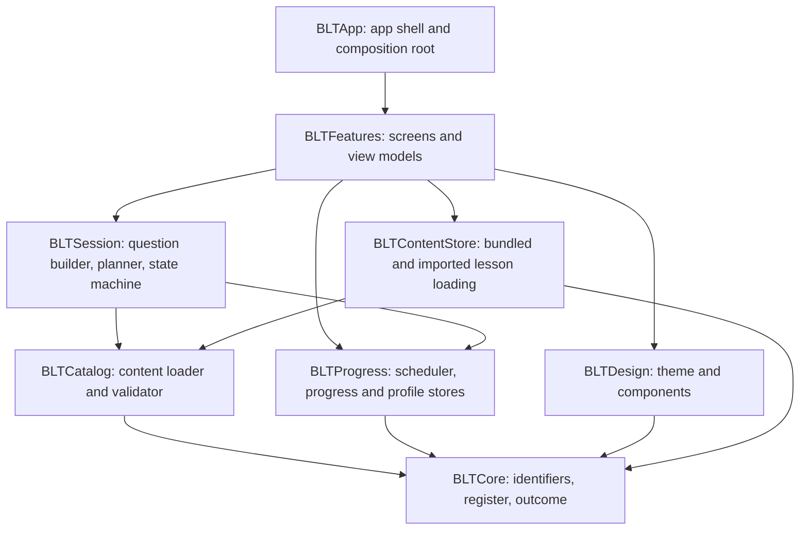

# BLT.ai architecture (v1, as built)

blt.ai is a text-only, multiple-choice SwiftUI app that teaches colloquial Tamil to Telugu speakers. Everything runs on the device: there is no backend, no account, and no network code. This page describes what exists today. The voice product in [`PRD.md`](PRD.md) and [`BUILD_PLAN.md`](BUILD_PLAN.md) is the v2 plan, not the current code.

## Module map

The logic lives in a local Swift package, `Packages/BLTKit`. The app target is a thin shell that wires it together.

| Module | Responsibility | Depends on |
|---|---|---|
| `BLTCore` | Small shared value types: item and scenario ids, register, addressee, outcome, review status | none |
| `BLTCatalog` | Reads lesson JSON, validates it (schema, option rules, size limits) and builds the `Catalog`. Never throws: every problem becomes a `ContentIssue` and valid items survive | Core |
| `BLTProgress` | SM-2 scheduling, the progress file and the profile (name) file, with typed errors | Core |
| `BLTSession` | Picks what to ask (due items first, then new ones, shuffled), builds the four options, and runs the question state machine | Core, Catalog, Progress |
| `BLTDesign` | Palette, theme, buttons, shimmer, completion bar. The only module that knows colours | Core |
| `BLTContentStore` | Finds the bundled lesson files, layers the learner's imported lessons over them, and validates and stores imports | Core, Catalog |
| `BLTFeatures` | The screens (intro, onboarding, Home, session, Progress, Settings) and their view models | all of the above |
| `BLTApp` | Entry point and the composition root: the one place that chooses concrete types | BLTFeatures |

## How a practice session works

1. **Content** is JSON in [`content/`](../content/), bundled into the app. `BLTContentStore` adds any imported files on top; `BLTCatalog` validates everything and produces the `Catalog`.
2. **Planning** (`SessionPlanner`): items that are due come first, then new items, up to ten, shuffled so answers cannot be learned by position.
3. **Questions** (`QuestionBuilder`): the correct answer, the other-register version (for casual and respectful items) and wrong options, shuffled. Each answer becomes an `Outcome`: correct, right sentence in the wrong register, or wrong.
4. **Scheduling** (`SM2Scheduler`): the outcome updates the item's review state. A wrong answer is due again at once; an item counts as complete only while its latest answer is correct.
5. **Persistence** (`FileProgressStore`): one small JSON file per store, written atomically with complete file protection. A corrupt file is reported and never overwritten.

## Data on the device

| File (Application Support/BLT) | Holds |
|---|---|
| `progress.json` | Review states and the answer history |
| `profile.json` | The learner's display name |
| `content/` | Imported lesson files and their manifest (only after an import) |

The display name is the only personal data and it never leaves the device ([`DECISIONS.md`](DECISIONS.md) 030).

## Lesson import

Settings can import lesson files from the Files app ([`DECISIONS.md`](DECISIONS.md) 036). The batch is validated as a whole, all or nothing, against the catalog the learner would end up with. Accepted files are stored under a hash of the scenario id, never the user's file name. A manifest, written last, says which are active, and an import is ignored if a newer build ships different bundled lessons for that scenario.

## Composition and dependency injection

`CompositionRoot` builds `AppDependencies` (catalog, progress store, scheduler, clock) and the profile store, and hands them to `RootView`. There are no singletons. After an import the root rebuilds `AppDependencies` with a freshly loaded catalog and reuses the stores, so progress is untouched.

## What keeps the rules true

| Rule | Enforced by |
|---|---|
| No network, audio or speech APIs, no new Info.plist permissions | `scripts/check-forbidden-apis.sh` (source and project files) and `scripts/check-binary.sh` (the built app) |
| Warnings are errors, strict concurrency | `Package.swift` settings, `scripts/test.sh`, SwiftLint strict |
| No machine name or real email in commit history | `scripts/check-identity.sh` in CI and as a pre-push hook |
| Tamil text only in `content/*.json`; test fixtures are obviously fake | content conformance tests and review |
| Imported and bundled lessons are untrusted input | the same validator for both |

## Testing

- **Package tests** (Swift Testing): fast and deterministic, with in-memory stores and fake `zz` fixtures. This is where almost all behaviour is checked.
- **UI tests** (XCUITest): the critical flows plus accessibility audits at the default and the largest text size. They are slow, so run them per class.
- **Content conformance tests** read the real `content/` folder and fail if any shipped item is invalid.
- **CI** (GitHub Actions on the `xcode-27` preview image) runs the guardrails, lint, package tests and UI tests. Changes reach `main` through pull requests with these checks required.

## Where v2 (voice) plugs in

`Outcome` and the session state machine are deliberately independent of how an answer is produced, so spoken answers can feed the same scheduler. The audio and scoring modules described in the PRD do not exist yet and would be new modules beside these. Their constraints (on-device speech only, audio deleted after each attempt) are written down in `CLAUDE.md` and [`SECURITY.md`](SECURITY.md) so they apply from the first line.

## Decisions

The reasoning behind each choice is in [`DECISIONS.md`](DECISIONS.md), including the ones that were reversed. Decisions 024 to 037 define v1.
