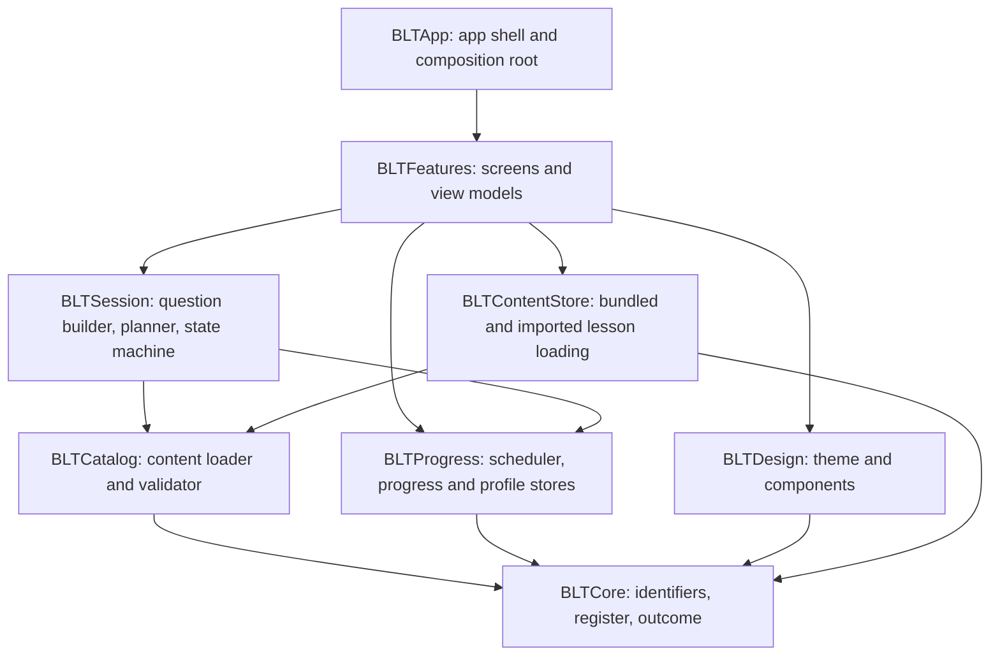

# BLT.ai architecture (v1, as built)

blt.ai is a text-only, multiple-choice SwiftUI app. Today it teaches colloquial Tamil to Telugu speakers; it is a two-way course, Tamil and Telugu, for a couple learning each other's language (see "Two courses" below; only the Tamil lessons are written so far). Everything runs on the device: there is no backend, no account, and no network code. Unless a section says "planned", this page describes what exists today. The voice product in [`PRD.md`](PRD.md) and [`BUILD_PLAN.md`](BUILD_PLAN.md) is the v2 plan, not the current code.

## Module map

The logic lives in a local Swift package, `Packages/BLTKit`. The app target is a thin shell that wires it together.

| Module | Responsibility | Depends on |
|---|---|---|
| `BLTCore` | Small shared value types: item and scenario ids, register, addressee, outcome, review status | none |
| `BLTCatalog` | Reads lesson JSON, validates it (schema, option rules, size limits) and builds the `Catalog`. Never throws: every problem becomes a `ContentIssue` and valid items survive | Core |
| `BLTProgress` | SM-2 scheduling, the progress file and the profile (name and language) file, with typed errors, and the one-time clean-up of the old build's files | Core |
| `BLTSession` | Picks what to ask (due items first, then new ones, shuffled), builds the four options, and runs the question state machine | Core, Catalog, Progress |
| `BLTDesign` | Palette, theme, buttons, shimmer, completion bar. The only module that knows colours | Core |
| `BLTContentStore` | Finds the bundled lesson files, layers the learner's imported lessons over them, and validates and stores imports | Core, Catalog |
| `BLTFeatures` | The screens (intro, onboarding, Home, session, Progress, Settings) and their view models | all of the above |
| `BLTApp` | Entry point and the composition root: the one place that chooses concrete types | BLTFeatures |

`BLTFeatures` keeps its screens and view models `internal`. The app target uses only `RootView`, `AppDependencies`, `CourseServices`, `LessonImporting`, `LessonChange` and the DEBUG-only `PreviewCatalog` fixtures; its own tests reach the rest with `@testable import`. The lower modules stay public because other modules use them.

## How a practice session works

1. **Content** is JSON in [`content/`](../content/), bundled into the app. `BLTContentStore` adds any imported files on top; `BLTCatalog` validates everything and produces the `Catalog`.
2. **Planning** (`SessionPlanner`): items that are due come first, then new items, up to ten, shuffled so answers cannot be learned by position.
3. **Questions** (`QuestionBuilder`): the correct answer, the other-register version (for casual and respectful items) and wrong options, shuffled. Each answer becomes an `Outcome`: correct, right sentence in the wrong register, or wrong.
4. **Scheduling** (`SM2Scheduler`): the outcome updates the item's review state. A wrong answer is due again at once; an item counts as complete only while its latest answer is correct.
5. **Persistence** (`FileProgressStore`): one small JSON file per store, written atomically with complete file protection. A corrupt file is reported and never overwritten.

## Data on the device

| File (Application Support/BLT) | Holds |
|---|---|
| `profile.json` | The learner's display name and the language being learned (shared by both courses) |
| `courses/<language>/progress.json` | That language's review states and answer history |
| `courses/<language>/content/` | That language's imported lesson files and their manifest (only after an import) |

`<language>` is `tamil` or `telugu`. The bundled lessons are `content/<language>/` inside the app. The display name is the only personal data and it never leaves the device ([`DECISIONS.md`](DECISIONS.md) 030).

The single-course build kept `progress.json` and `content/` directly in `BLT/`. Nothing is migrated (no learner had progress, and the lesson ids changed); `LegacyStorageSweep` (in `BLTProgress`) removes those two paths once at the first launch of the new build. It touches only those two names, never follows a symbolic link, leaves `profile.json` and `courses/` alone, and is skipped for UI-test launches.

## Lesson import

Settings can import lesson files from the Files app ([`DECISIONS.md`](DECISIONS.md) 036). The batch is validated as a whole, all or nothing, against the catalog the learner would end up with. Accepted files are stored under a hash of the scenario id, never the user's file name. A manifest, written last, says which are active, and an import is ignored if a newer build ships different bundled lessons for that scenario.

## Composition and dependency injection

The learner's language is only known after the profile has loaded, so the root is not built on one fixed set of dependencies. `RootView(profileStore:makeCourse:onLessonsChanged:)` takes a closure that `CompositionRoot` answers per language with `CourseServices`: the `AppDependencies` for that language (its catalog, `language`, progress store, scheduler and clock) and the importer that stores lessons for that language only. `RootView` builds Home only once the profile has a language, and gives Home that language as its identity, so switching language in Settings rebuilds Home and every view model under it on the other course. There are no singletons.

`AppDependencies.language` is a required parameter: nothing builds a course for a language it was not told, and a profile with no language is asked for one rather than given Tamil. After a lesson import or removal the app creates a new root, which asks `makeCourse` again for the current language, so the catalog is loaded afresh while the stores are the ones already open and progress is untouched.

## What keeps the rules true

| Rule | Enforced by |
|---|---|
| No network, audio or speech APIs, no new Info.plist permissions | `scripts/check-forbidden-apis.sh` (source and project files) and `scripts/check-binary.sh` (the built app) |
| Warnings are errors, strict concurrency | `Package.swift` settings, `scripts/test.sh`, SwiftLint strict |
| No machine name or real email in commit history | `scripts/check-identity.sh` in CI and as a pre-push hook |
| Lesson text (Tamil today, Telugu planned) only in `content/`; test fixtures are obviously fake | content conformance tests and review |
| Imported and bundled lessons are untrusted input | the same validator for both |

## Testing

- **Package tests** (Swift Testing): fast and deterministic, with in-memory stores and fake `zz` fixtures. This is where almost all behaviour is checked.
- **Rules live in the package.** What a wrong answer does, what Home's completion figure counts, what Reset clears and keeps, what survives a relaunch: view-model and store tests (for example `SessionCompletionFlowTests` and `ProgressSurvivesAndResetsFlowTests`), which run in milliseconds. A UI test checks a rule only when the screen or the real app process is the thing under test (DECISIONS 045).
- **UI tests** (XCUITest) come in two tiers, chosen by test class (`scripts/test.sh tiers` prints them):
  - *PR tier:* `AccessibilityUITests` (an accessibility audit of each screen at the default text size) and `HappyPathUITests` (one happy path per screen). This is what a pull request runs.
  - *Full tier:* every class, which adds the audits and reachability checks at the largest text size (`AccessibilityLargeTextUITests`) and the detailed screen tests (onboarding, Home card, End session, feedback screens, persistence, settings). It runs on every push to `main`, nightly and on demand.
  - A new screen gets one happy-path test and one default-size audit in the PR tier, and its largest-size audit in the full tier. The shared audit code and its few documented exceptions are in `AccessibilityAuditCase`.
- **Content conformance tests** read the real `content/` folder and fail if any shipped item is invalid.
- **CI** (GitHub Actions on the `xcode-27` preview image) runs the guardrails and lint, the package tests, and the UI tests as separate parallel jobs; the app is built once (`build-for-testing`) and the tests run without rebuilding. A small gate job named `Package and app tests` reports both test jobs as one required check. Changes reach `main` through pull requests with `Guardrails and lint` and `Package and app tests` required. UI tests retry up to three times, and the job summary lists every test that needed a retry. Measurements behind the tiers: [`TEST_TIMINGS.md`](TEST_TIMINGS.md).

## Two courses

[`DECISIONS.md`](DECISIONS.md) 042 to 044 and `plan.md` describe the change. The engine does not look at the language, so the module map did not change.

| Area | How it works |
|---|---|
| Language | `CourseLanguage` (`tamil`, `telugu`) in `BLTCore`; chosen at onboarding (after the name), stored on the profile, switchable in Settings. A profile without one is asked, never assumed |
| Lessons | `content/tamil/` and `content/telugu/` (100 lessons each planned, in 8 levels); each file names its `language` and `level`; a lesson in the other course is rejected, bundled or imported |
| Lesson format | Required `language`; gloss key `word`; `script` checked against the language's own script |
| Data on the device | `courses/<language>/` holds progress and imports; `profile.json` is shared (see above) |
| Composition | Dependencies built per language on request (see above); switching language rebuilds Home |
| Home | Grouped by level, with a Continue suggestion and the language being learned |
| Reset progress | Clears only the language being learned; the confirmation names it |
| Import | Into the current language only; a file for the other language is refused with a plain message |
| Exam | Planned: one 100-question paper per language (041), not built yet |

## Where v2 (voice) plugs in

`Outcome` and the session state machine are deliberately independent of how an answer is produced, so spoken answers can feed the same scheduler. The audio and scoring modules described in the PRD do not exist yet and would be new modules beside these. Their constraints (on-device speech only, audio deleted after each attempt) are written down in `CLAUDE.md` and [`SECURITY.md`](SECURITY.md) so they apply from the first line.

## Decisions

The reasoning behind each choice is in [`DECISIONS.md`](DECISIONS.md), including the ones that were reversed. Decisions 024 to 037 define v1; 038 to 044 define the two-course plan.
